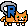
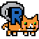
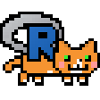
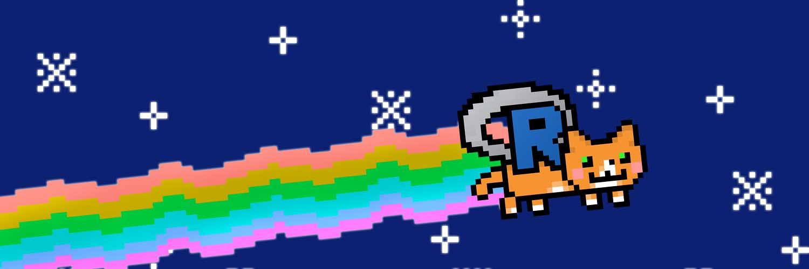

# random_rstatscat

i`ll start my journey into github by misusing it for sharing images. My next repo will be proper programming, I promise.
the pixelart ist done by me, feel free to use it as you please, but keep in mind its a riff on that famous rainbow cat, which is surely is copyright protected by someone in some form.

28x28_rstatscat.png, 56x56_rstatscat.png, 112x112_rstatscat.png which should be compatible to generate twitch emotes (so i did not test that)

150x50_rstatscat.png is the native size, 1500x500_rstatscat.jpg is scaled up with a bit of glow effects.

thanks to kierisi for all the free rstats learning material you provide, say hi to jinx! 

